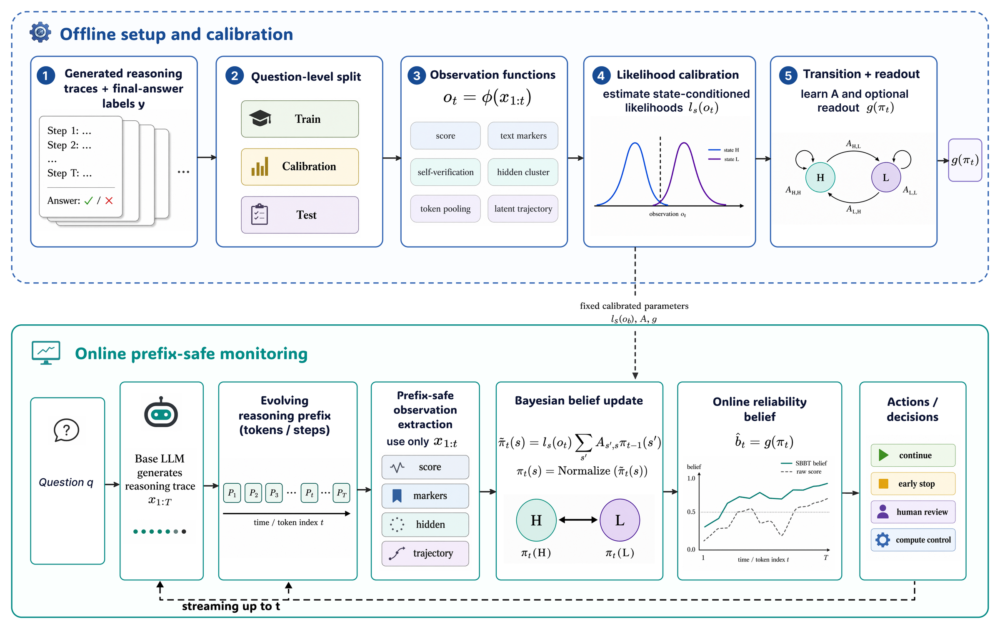
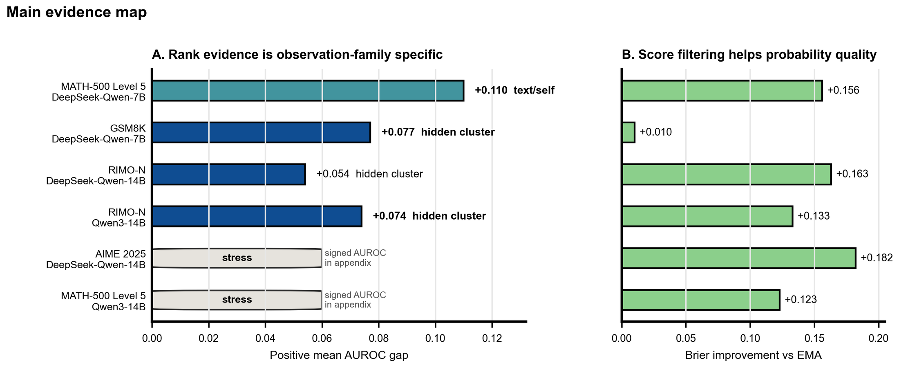
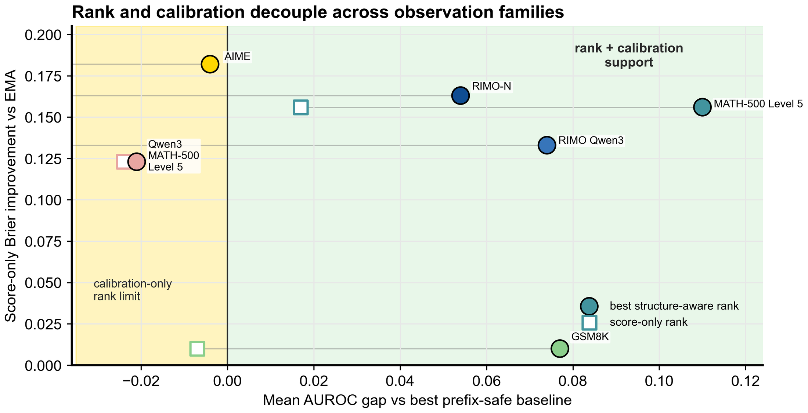

<p align="center">
  
</p>

<h1 align="center">Bayesian Belief Tracking</h1>

<p align="center">
  <b>Prefix-safe Bayesian reliability tracking for LLM reasoning traces.</b>
  <br>
  Calibrate noisy prefix observations, update belief online, and audit when calibration and ranking diverge.
</p>

<p align="center">
  <a href="https://github.com/HaningZS/Bayesian-Belief-Tracking.git"></a>
  
  
  
  
</p>

---

Bayesian Belief Tracking is a compact research codebase for turning noisy
per-prefix observations from a generated reasoning trace into an online
reliability trajectory:

```text
P(final_success = 1 | observations up to prefix t)
```

The code implements the algorithmic core behind Sequential Bayesian Belief
Tracking (SBBT): observation extraction, likelihood calibration, Bayesian
filtering, prefix-safe baselines, split-seed diagnostics, and offline tests.
It is intentionally built around pre-observed trace files, so the core
package runs without GPUs, API keys, model downloads, or hidden environment
variables.

<p align="center">
  
</p>

## What This Repository Is For

<table>
  <tr>
    <td><b>Online reliability</b></td>
    <td>Estimate whether a partial reasoning trace still supports eventual final-answer success.</td>
  </tr>
  <tr>
    <td><b>Prefix-safe evaluation</b></td>
    <td>Use only observations visible at prefix time plus parameters fitted before test evaluation.</td>
  </tr>
  <tr>
    <td><b>Observation-agnostic tracking</b></td>
    <td>Feed scores, text markers, hidden clusters, token-pooling probes, or latent trajectories through the same filter.</td>
  </tr>
  <tr>
    <td><b>Calibration vs ranking</b></td>
    <td>Measure probability quality and rank quality separately instead of collapsing both into one leaderboard.</td>
  </tr>
</table>

## Included Components

| Layer | What is included |
|---|---|
| Trace contract | JSONL schema for questions, generated traces, final labels, and ordered prefix observations. |
| Splitting | Question-level train/calibration/test splits to avoid leakage across traces from the same problem. |
| Calibration | Histogram, quantile, categorical, joint, and EM emission likelihoods. |
| Filtering | Online forward filtering plus offline-only Viterbi and smoothing diagnostics. |
| Baselines | Last-prefix score, mean score, moving average, EMA, calibrated temporal baselines, learned prefix baselines, and prefix-feature classifiers. |
| Observation rewrites | Text/self-verification concepts, score dynamics, hidden-vector probes, hidden clusters, latent trajectories, activation trajectories, and termination-hazard diagnostics. |
| Evaluation | AUROC, AUPRC, Brier score, ECE, split-seed robustness, utility tables, prefix-belief exports, and rollout aggregation helpers. |

## Quick Start

Use Python 3.10 or newer.

```bash
python -m pip install -e '.[dev]'
python -m pytest
```

Run the deterministic smoke example:

```bash
python - <<'PY'
from csbf.smoke import run_offline_smoke

result = run_offline_smoke()
print(result["metrics"])
PY
```

Run the fixture-backed pre-observed pipeline:

```bash
python -m scripts.run_preobserved_pipeline \
  data/fixtures/preobserved_traces.jsonl \
  --train-ratio 0.34 \
  --calibration-ratio 0.33 \
  --seed 0
```

Inspect a trace file before evaluation:

```bash
python -m scripts.inspect_trace_jsonl data/fixtures/preobserved_traces.jsonl
```

Run a split-seed hidden-cluster diagnostic:

```bash
python -m scripts.run_hidden_cluster_split_seed_sweep \
  data/fixtures/preobserved_traces.jsonl \
  path/to/features.jsonl \
  --seed-count 20 \
  --output-json diagnostics/hidden_cluster_sweep.json \
  --output-csv diagnostics/hidden_cluster_sweep.csv
```

## Trace JSONL Contract

The downstream pipeline expects one JSON object per generated reasoning trace:

```json
{
  "question_id": "q1",
  "question": "problem text",
  "trace_id": "q1-t0",
  "trace_text": "reasoning text",
  "final_answer": "1",
  "gold_answer": "1",
  "correct": true,
  "observations": [
    {
      "step_index": 0,
      "text": "prefix text",
      "score": 0.72,
      "concept_code": 2
    }
  ]
}
```

The critical invariant is that `question_id` defines the split boundary.
Multiple traces from the same question must stay in the same partition.

## Method Sketch

At prefix `t`, the online tracker consumes only prefix-visible evidence:

```text
trace prefix x_1:t
  -> observation phi(x_1:t)
  -> calibrated emission likelihood p(o_t | z_t)
  -> Bayesian belief update p(z_t | o_1:t)
  -> online reliability readout
```

The latent states are best read as high-reliability and low-reliability
states induced by final-answer supervision. They are not ground-truth
step-correctness labels. Viterbi and smoothing are included for offline
diagnostics; forward filtering is the online method.

## Diagnostic Views

<table>
  <tr>
    <td width="50%">
      
    </td>
    <td width="50%">
      
    </td>
  </tr>
  <tr>
    <td><b>Evidence regimes.</b> Structure-aware observations can improve ranking when standard prefix-safe baselines have not already absorbed the useful rank signal.</td>
    <td><b>Calibration vs ranking.</b> Brier improvements and AUROC improvements are measured as separate axes, since a better probability score need not improve ordering.</td>
  </tr>
</table>

## Repository Layout

```text
csbf/
  schema.py                 Trace and observation dataclasses.
  split.py                  Question-level split utilities.
  calibration.py            Emission likelihood calibration.
  filtering.py              Bayesian reliability filter.
  evaluation.py             Baseline and tracker evaluation.
  hidden_probe.py           Standard-library hidden-vector probe.
  hidden_concepts.py        Train-split hidden-vector clustering.
  latent_trajectory.py      Prefix-safe hidden trajectory metrics.
  prefix_rollouts.py        Prefix-continuation task/aggregation helpers.
  utility_table.py          Online threshold diagnostics.

scripts/
  run_preobserved_pipeline.py
  inspect_trace_jsonl.py
  rewrite_text_concepts.py
  rewrite_score_dynamics.py
  run_hidden_probe_observation.py
  run_hidden_cluster_concepts.py
  run_latent_trajectory_baseline.py
  export_prefix_rollout_tasks.py
  export_prefix_belief_predictions.py
  evaluate_prefix_rollouts.py

data/fixtures/
  preobserved_traces.jsonl

tests/
  Offline tests for the included core.
```

## Design Boundaries

This public package is focused on the core algorithm and pre-observed trace
workflow. It does not include private experiment logs, paper build artifacts,
server queue scripts, API-key plumbing, model-cache paths, generated result
directories, or local GPU orchestration.

To plug in your own generator or verifier, write trace records in the JSONL
contract above, then use the calibration/filtering/evaluation stack unchanged.

## Development

Run the test suite:

```bash
python -m pytest
```

Run a focused smoke test:

```bash
python -m pytest tests/test_smoke_pipeline.py
```

Check importability without optional dependencies:

```bash
python - <<'PY'
import csbf
from csbf.smoke import run_offline_smoke

print(csbf.__version__)
print(run_offline_smoke()["metrics"].keys())
PY
```

## Acknowledgments

This repository is a research artifact for studying online reliability
estimation in LLM reasoning traces. It is designed to make the core Bayesian
tracking layer easy to inspect, test, and reuse.
